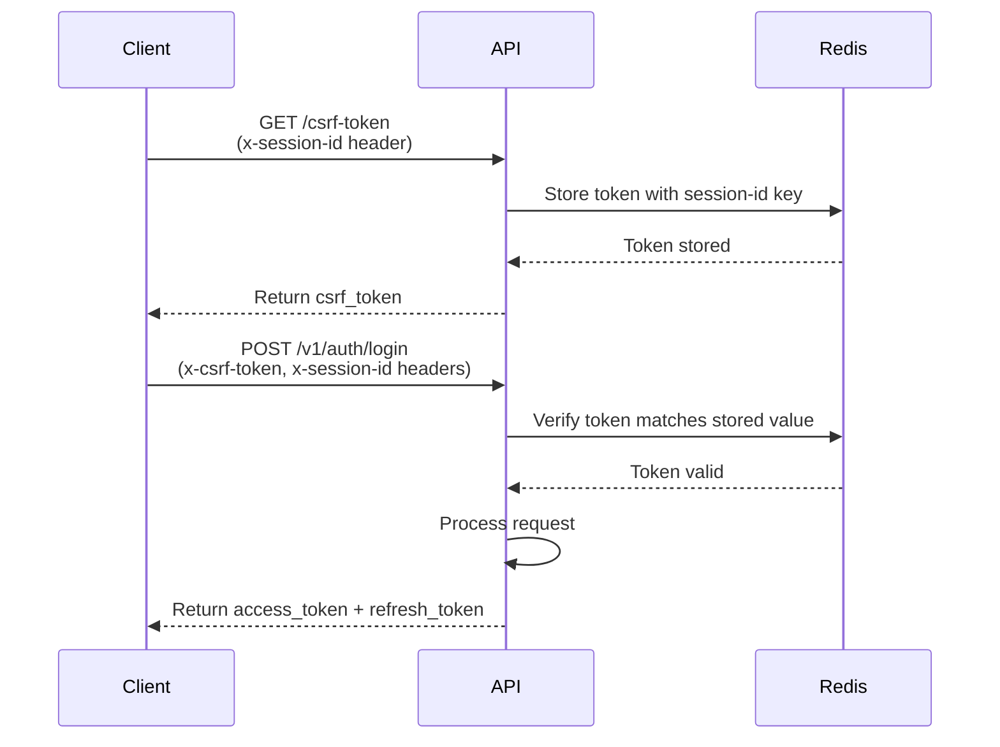

# Co-Contributor Onboarding Plan

## Project Overview

This is a NestJS-based inventory tracking system for a bottle blowing business. The project follows domain-driven design principles with a focus on security (CSRF protection, JWT auth), comprehensive testing (Jest + Testcontainers), and consistent API patterns.

## Key Architecture Patterns

### 1. Domain Structure

Each domain follows a consistent structure:

```javascript
domains/{domain-name}/
    - dto/              # Data Transfer Objects
    - entities/         # TypeORM entities
    - {domain}.controller.ts
    - {domain}.service.ts
    - {domain}.module.ts
```


### 2. Route Conventions

- **Search endpoints**: Use `GET /search` with query parameters instead of `GET /`

- **Versioning**: All routes prefixed with `/v1/`

- **Pagination**: Standardized using `PaginatedDto` with `page`, `limit`, `total`

- **Search**: Query parameter `query` for text search, `from_time`/`to_time` for date filtering

### 3. Authentication & Security

- **CSRF Protection**: Custom middleware using Redis

- Client must request CSRF token via `GET /csrf-token` with `x-session-id` header
- All non-GET requests require `x-csrf-token` and `x-session-id` headers
- Tokens stored in Redis with 24-hour TTL

- **JWT Auth**: Access tokens (short-lived) + Refresh tokens (long-lived)

- Refresh tokens stored in `user_sessions` table

- Access tokens validated via `JwtOrApiKeyGuard` (global guard)

- **Public Routes**: Use `@UnauthenticatedRoute()` decorator

### 4. Common Patterns

#### Entities

- Extend `BaseEntity<T>` from `src/common/base.entity.ts`
- Implement `toDto()` method using `@SetDto()` decorator

- Use Unix timestamps (`bigint`) for `created_at`/`updated_at`

#### DTOs

- Extend `BaseDto` for common fields
- Use `class-validator` decorators

- Search DTOs extend `SearchDto` and include pagination fields
- Use `collection()` static method for array responses

#### Controllers

- Use `@ApiBearerAuth()` and `@ApiTags()` for Swagger

- Apply `@AuditLog()` decorator for tracking
- Return `{ data: ... }` wrapper for single items
- Use `PaginatedDto` for search/list endpoints

#### Services

- Use TypeORM repositories
- Implement `search()` method with QueryBuilder

- Use `findOneByOrFail()` for required lookups

## Development Setup

### Prerequisites

- Node.js v22.x
- pnpm (global install)
- Docker & Docker Compose

- (Optional) Adminer for DB management

### Initial Setup

```bash
# Clone and install
git clone <repo-url>
cd tripple-t-backend
pnpm install

# Use Makefile for quick setup (recommended)
make quick-start

# Or manual setup
docker-compose up --build
pnpm run migration:run
pnpm run seed
```


### Environment Variables

Key variables needed:

- Database credentials (`DB_USERNAME`, `DB_PASSWORD`, `DB_DATABASE`, `DB_PORT`)
- `APP_PORT` (default: 3000)
- `REDIS_URL`
- `JWT_SECRET` / JWT config
- `FRONTEND_URL` for CORS
- `DISABLE_CSRF_PROTECTION` (optional, for testing)

### Running Tests

```bash
# Unit tests
pnpm run test:unit

# E2E tests (uses testcontainers)
pnpm run test:e2e

# Coverage
pnpm run test:cov
```


## Testing Patterns

### E2E Test Structure

1. Use `setupApplication()` from `test/setup/app.ts`
2. Get CSRF token: `getCsrfToken(app)`

3. Login: `loginAdmin(app, csrf)`

4. Make requests: `makeAuthenticatedRequest(app, csrf, accessToken)`
5. Cleanup: Stop containers in `afterAll`

### Test Helpers

- `test/setup/app.ts`: Application setup, CSRF, auth helpers

- `test/setup/helper.ts`: Redis setup for testcontainers

- Mock services: `MockS3Service` for uploads

### Test Data

- Use `@faker-js/faker` for test data generation

- Seed admin user: `admin@clubconnect.com` / `XLmIYxQj7R8d0mw`

## Code Contribution Guidelines

### File Naming

- Controllers: `{domain}.controller.ts`
- Services: `{domain}.service.ts`

- Entities: `{entity-name}.entity.ts`

- DTOs: `{purpose}-{domain}.dto.ts` (e.g., `create-product.dto.ts`)

### Code Style

- Use TypeScript strict mode
- Follow ESLint rules (run `pnpm run lint`)
- Use Prettier for formatting (`pnpm run format`)

- Path aliases: Use `@/` for `src/` imports

### Adding New Domains

1. **Create domain structure**:

   ```bash
      src/domains/{domain-name}/
                - dto/
                - entities/
                - {domain}.controller.ts
                - {domain}.service.ts
                - {domain}.module.ts
   ```


2. **Entity**:

- Extend `BaseEntity<{Domain}Dto>`
- Add `@SetDto({Domain}Dto)` decorator

- Use `@Entity('table_name')` with snake_case

3. **DTOs**:

- `Create{Domain}Dto`: For POST requests
- `Update{Domain}Dto`: For PATCH requests
- `{Domain}Dto`: Response DTO (extends BaseDto)
- `SearchAndPaginate{Domain}Dto`: For search endpoints

4. **Controller**:

- Use `@Controller({ path: '{domain}', version: '1' })`
- Implement `GET /search` endpoint

- Implement `GET /:id` endpoint
- Add `@AuditLog()` decorator

5. **Service**:

- Inject repository via `@InjectRepository()`

- Implement `create()`, `search()`, `findOneByOrFail()`, `update()`, `delete()`

6. **Module**:

- Import `TypeOrmModule.forFeature([{Domain}Entity])`
- Export service

7. **Register in AppModule**:

- Add domain module to imports array

8. **Migration**:
   ```bash
      pnpm run migration:create --name=create-{domain}-table
   ```


9. **E2E Tests**:

- Create `test/{domain}/{domain}.e2e-spec.ts`
- Follow existing test patterns

### CSRF Token Flow




### Search Endpoint Pattern

All search endpoints follow this pattern:

- Route: `GET /v1/{domain}/search`

- Query params: `query`, `page`, `limit`, `from_time`, `to_time`, `order_by`, `order_direction`
- Response: `PaginatedDto<{Domain}Dto>`

Example implementation:

```typescript
@Get('search')
async search(@Query() query: SearchAndPaginate{Domain}Dto) {
  const [data, total] = await this.{domain}Service.search(query);
  return new PaginatedDto({Domain}Dto.collection(data), {
    total,
    page: query.page ?? 0,
    limit: query.limit ?? 0,
  });
}
```


## Common Tasks

### Adding a New Endpoint

1. Add DTOs if needed
2. Add service method
3. Add controller route
4. Add Swagger decorators
5. Add `@AuditLog()` decorator

6. Write E2E test

### Database Changes

1. Create migration: `pnpm run migration:create --name={description}`

2. Implement migration in `src/database/migrations/`
3. Test migration: `pnpm run migration:run`

4. Update entity if needed

### Debugging

- Use `pnpm run start:debug` for debugging

- Check Swagger docs: `http://localhost:3000/documentation`
- View logs: `make logs` or `docker-compose logs`

## Code Review Checklist

- [ ] Follows domain structure pattern

- [ ] Uses `/search` endpoint convention
- [ ] Includes CSRF token handling in tests
- [ ] Has proper Swagger documentation

- [ ] Includes `@AuditLog()` decorator
- [ ] Uses `PaginatedDto` for list endpoints

- [ ] DTOs use proper validation decorators
- [ ] E2E tests cover happy path and error cases
- [ ] Migration files are properly formatted
- [ ] No hardcoded values (use config service)
- [ ] Error handling is consistent

- [ ] Code passes linting (`pnpm run lint`)

## Security Considerations

### CSRF Implementation Assessment

Your CSRF implementation is **well-designed** for a learning project:

- ✅ Uses cryptographically secure tokens
- ✅ Timing-safe comparison
- ✅ Redis storage with TTL

- ✅ Session-based approach

**Considerations**:

- For production, consider shorter TTL (1-2 hours)
- May want to rotate tokens on use for extra security
- Consider rate limiting on `/csrf-token` endpoint

### Best Practices

- Always validate input with DTOs
- Use parameterized queries (TypeORM handles this)
- Never expose sensitive data in logs
- Use `@AuditLog({ has_sensitive_record: true })` for sensitive operations

## Useful Commands Reference

```bash
# Development
pnpm run start:dev          # Start with hot reload
pnpm run build              # Build for production
pnpm run lint               # Lint code
pnpm run format             # Format code

# Database
pnpm run migration:create   # Create migration
pnpm run migration:run      # Run migrations
pnpm run migration:revert   # Revert last migration
pnpm run seed               # Seed database

# Testing
pnpm run test:unit          # Unit tests
pnpm run test:e2e           # E2E tests
pnpm run test:cov           # Coverage report

# Docker
make up                     # Start services
make down                   # Stop services
make logs                   # View logs
make shell                  # Access container shell
```


## Next Steps

1. **Familiarize yourself**: Read through existing domains (customers, suppliers, purchase-records)

2. **Run tests**: Ensure all tests pass locally
3. **Explore Swagger**: Check API documentation at `/documentation`
4. **Start small**: Pick a small feature or bug fix
5. **Follow patterns**: Match existing code style and structure
6. **Write tests**: Always include E2E tests for new features

## Questions to Clarify

Before contributing, consider asking:

- What's the priority roadmap?
- Are there any architectural decisions in progress?
- What's the branching strategy? (main/develop, feature branches?)
- How are pull requests reviewed?

